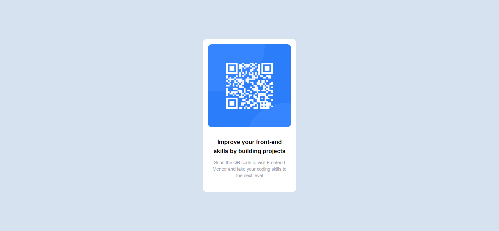

# Frontend Mentor - QR code component solution

This is a solution to the [QR code component challenge on Frontend Mentor](https://www.frontendmentor.io/challenges/qr-code-component-iux_sIO_H). Frontend Mentor challenges help you improve your coding skills by building realistic projects.

## Table of contents

- [Overview](#overview)
  - [Screenshot](#screenshot)
  - [Links](#links)
- [My process](#my-process)
  - [Built with](#built-with)
  - [What I learned](#what-i-learned)
- [Author](#author)
- [Acknowledgments](#acknowledgments)

**Note: Delete this note and update the table of contents based on what sections you keep.**

## Overview

### Screenshot

### Links

## My process

### Built with

- [Vite](https://vitejs.dev/) - React framework
- [React](https://reactjs.org/) - JS library
- [tailwindcss](https://tailwindcss.com/) - CSS framework

### What I learned

In this project i learn how to integerate tailwindcss and react. At first i'm still have an issue what tailwindcss style class do i put. But in the end it's help me for quick and consistent styling of HTML elements.

for responsive design, its easy to work with tailwind.

## Author

- github - [chadittya](https://github.com/chadittya)
- Frontend Mentor - [@chadittya](https://www.frontendmentor.io/profile/chadittya)
- Twitter - [@galiharizza](https://www.twitter.com/galiharizza)

## Acknowledgments

Thankyou for [Frontend Mentor](https://www.frontendmentor.io) for the challenge. Its helping for helping my skill with it's challenge.
